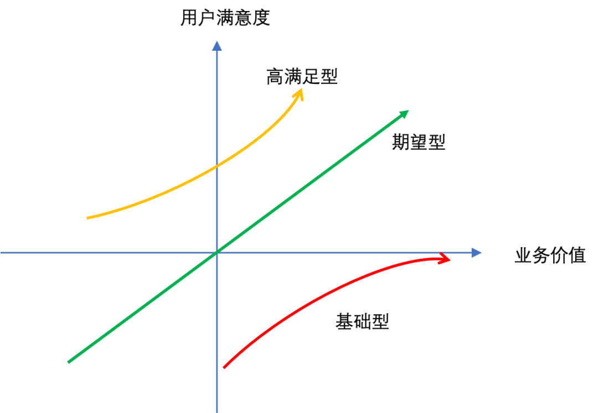
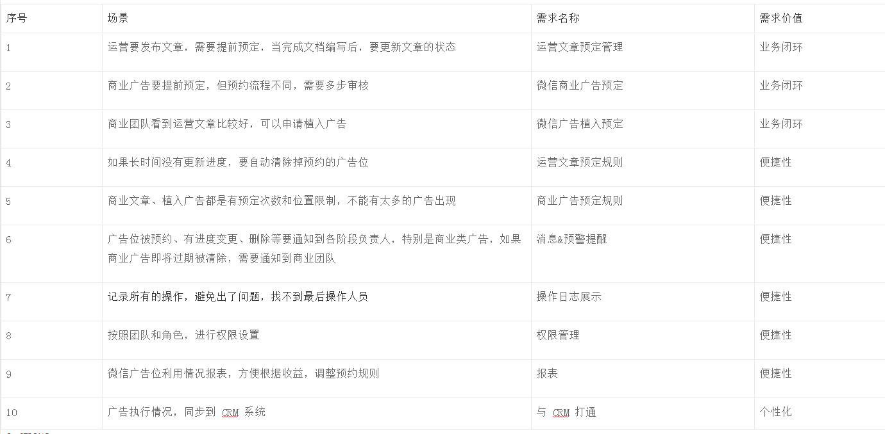
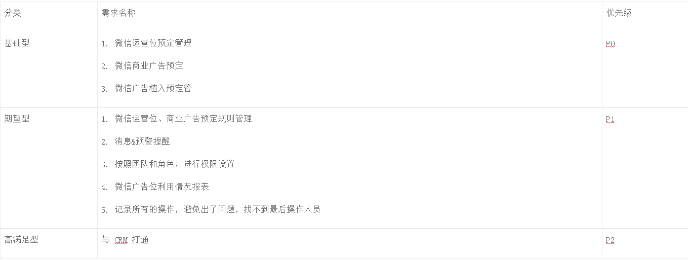
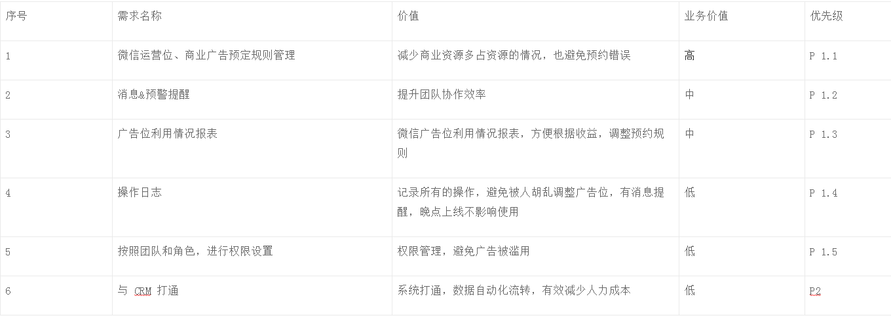

# 

> 经常收到需求的时候，因为时间问题，我们会没办法一次性完成运营的需求。所以会根据实际情况，给需求区分一下优先级。
根据不同情况, 常用的方法有两种：

#方法 1：KANO 模型
KANO 模型，是一种对用户需求分类和优先排序的工具，此模型可以将需求分为3 种：`基础型`、`期望型`和`高满足型`。

需求可以分为以下 3 类：

* 基础型需求

    也可以叫必备需求，没有这些功能，业务流程就不完整。

    例子：B 端业务的账号系统，没有的话，用户是无法使用的。

* 期望型需求

    这类需求是在业务跑通之后，提升客户的效率，这些功能多一点，客户满意度会高很多。

    例子：批量更新等，能有效的提升用户的效率。

* 高满足型需求

    这是用户自己想不到的，如果你有了这些功能服务，可以非常满意；如果没有，客户也想不到，也无所谓。

    例子：SOP（Standard Operating Procedure ，即标准作业程序）工具。产品经理对业务和行业非常熟悉后，可以为用户定义标准业务流程，当达到某种条件自动执行，极大的减少人力成本，有效的提高工作效率。

需求类型对应的业务价值和用户满意度，如下图：

KANO 模型（图片来源：自己画的）

我们可以看到，`基础型需求`是必备的，如果没有那业务是跑不起来的，如果非常完善，也仅仅是刚刚满足用户的目标而已，用户满意度也不会高。这也是很多产品经理感觉自己做了很多事情，业务方不会给你好评的原因。

`期望型需求`，是帮助客户解决便捷性的问题。同样是一个「患者挂号」功能，竞品只可以选择「科室挂号」，而你比竞品功能多了可选择「医生挂号」，那客户选择购买你产品的几率会更大一些。

`高满足型需求`，这个需要产品经理对业务和行业认知度非常高，才可能做出类似的需求。

案例分享
下面通过一个真实的案例，来给大家看下，如果通过「KANO 模型」，快速定义优先级。

* 需求背景

    疫情期间，我们团队接到一个需求：要管理公司所有微信的文章发布情况，要发布文章需要提前预定，如果要发商业广告，需要提前一段时间申请，并且申请次数有限制。

* 需求场景化 &拆分任务

    拿到这个需求，我们和业务团队进行了几次沟通，了解到业务团队使用场景，也明确定位「微信广告位预约系统」，基于需求和使用场景，我们对需求进行了拆分：

* 基于 KANO 模型，进行优先级整理

    `那我们基于 KANO 模型，对上面需求进行了分类整理，整理出需求列表。`

    基础型定位是「微信预定管理，促进各团队协作进度透明化」，没有这块需求是不完整的。

    期望型需求定位「减少团队之间不必要的沟通」，属于有这块内容，业务团队会满意，没有就会吐槽。

    高满足型需求定位是「系统打通，数据自定化流转」，没有这个业务团队照常用，如果有这个需求，业务团队就会非常开心，减少了两个系统切换的问题。

 

最终我们得到的优先级如下：

但我们看到，不同层级的需求还是很多，那同一层级的需求，怎么进行优先级排序呢？这就用到我们第二个需求管理策略：「产品价值模型」。

#方法 2：产品价值模型
产品价值可以分为两类：业务价值和用户价值。

价值定义：

* **业务价值：**对应商业类产品，称为商业价值，体现在能给业务带来多少收益。
* **用户价值：**对于使用者来说，能给他带来的价值，比如说能减少操作步骤。当业务价值与用户价值产生冲突的时候，优先于考虑业务价值。
通常来讲，基础型不存在优先级的，是一定要全做的。当然你可以分几个版本来实现，但如果基础型需求没有完善，业务方可能就用不起来。

对于期望型和高满足型需求来说，对业务价值高的优先，然后根据功能对使用者的价值，来确定优先级。

期望型和高满足型需求，最终我们得到的优先级如下：

**最终效果：**

通过「KANO 模型」和「价值模型」，我们很快完成需求拆分，虽然疫情期间在办公需要远程沟通，由于清晰的优先级拆分，得到业务方的认同，产品也很进入开发迭代。

经过 2 周的开发， P0 需求完成上线，业务方立即进入使用。因为了解我们的优先级规划，也没有催命连环 Call，按照每周一个版本的节奏，完成了 P1.1、P1.2需求，剩下的需求节奏逐步放缓，产品经理及时了解业务使用情况，后续版本中增加优化内容。

总结
这两个方法能较大颗粒度的判断需求的优先级，能帮你大致排好工作计划。

还有很多需求优先级管理方法，比如说矩阵分析法（重要紧急 > 重要不紧急>不重要紧急>不重要不紧急）、满足核心用户需求的优先（二八原则）等。

工具没有完美的，选适合自己的就好。